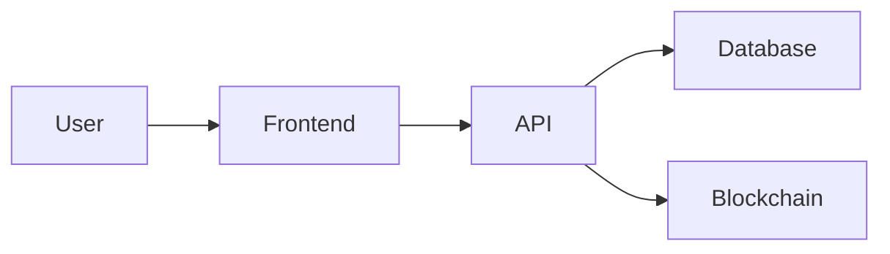

# Threat Model Command

Create a threat model for a system.

## Usage

```
/threat-model <system>
```

## Arguments

- `system` - Name or description of the system to model

## What This Does

1. Creates data flow diagram
2. Identifies trust boundaries
3. Applies STRIDE methodology
4. Ranks threats by risk
5. Recommends mitigations
6. Generates threat model document

## Output Format

```markdown
## Threat Model: [System]

### System Overview
[Description of system scope and components]

### Data Flow Diagram


### Trust Boundaries
| Boundary | From | To | Trust Level |
|----------|------|-----|-------------|
| B1 | User | Frontend | Untrusted |
| B2 | Frontend | API | Authenticated |
| B3 | API | Database | Internal |

### STRIDE Analysis
| Threat | Component | Risk | Mitigation |
|--------|-----------|------|------------|
| Spoofing | Auth | High | MFA, signatures |
| Tampering | API | Medium | Input validation |
| Repudiation | Transactions | High | Audit logging |
| Info Disclosure | Database | High | Encryption |
| DoS | API | Medium | Rate limiting |
| Elevation | Auth | Critical | RBAC |

### Attack Trees
[Key attack scenarios]

### Mitigations
| Threat | Control | Status | Owner |
|--------|---------|--------|-------|
| ... | ... | ... | ... |
```

## STRIDE Categories

| Category | Question | Example |
|----------|----------|---------|
| **S**poofing | Can attacker pretend to be someone else? | Stolen credentials |
| **T**ampering | Can attacker modify data? | Parameter manipulation |
| **R**epudiation | Can attacker deny actions? | Missing audit logs |
| **I**nfo Disclosure | Can attacker access private data? | SQL injection |
| **D**enial of Service | Can attacker disrupt service? | Resource exhaustion |
| **E**levation | Can attacker gain privileges? | Role bypass |

## Example

```
/threat-model wallet-service
```

## Related Commands

- `/attack-surface` - Analyze attack surface
- `/pentest-plan` - Plan penetration test
- `/security-scan` - Run security scan

## Agent

`norchain-cybersecurity-agent`
